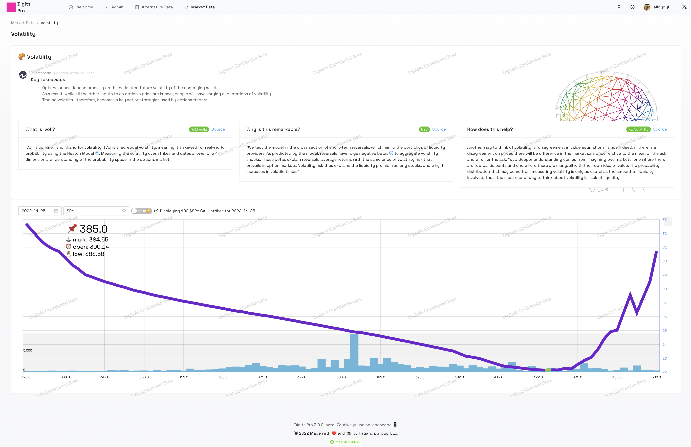

<p align="center">

<br>
DigitsUI is a highly configurable and ML-leveraged quantitative analysis platform for options traders and aspiring market makers 😉 <a href="https://dgtsapp.com" target="_blank">See it live!</a>
<br>
<a align="center target="_blank" rel="noreferrer" href="https://github.com/DylanAlloy/digits-api-main">digits-api-main</a> | <a target="_blank" rel="noreferrer" href="https://github.com/DylanAlloy/digits-api-tda">digits-api-tda</a> | <a target="_blank" rel="noreferrer" href="https://github.com/DylanAlloy/digits-api-altdata">digits-api-altdata</a> | <a target="_blank" rel="noreferrer" href="https://github.com/DylanAlloy/digits-api-ml">digits-api-ml</a> | <a target="_blank" rel="noreferrer" href="https://github.com/DylanAlloy/digits-helm-chart">✨ Now there's a Helm Chart! ✨</a>
<br>
</p>

<hr>

## 📝 Code Properties ✨     [](https://creativecommons.org/licenses/by-nc/4.0/)

##### The below tools work together in a stack. There is an extensive API and a user model that uses local tokens to keep user sessions authenticated.

| 📁 Library | ⚙ Purpose | 📎 Version |
| :-- | :-: | --: |
| [NodeJS](https://nodejs.org/en/) | Base | 16.18.0 |
| [React](https://reactjs.org) | UI Framework | 17.0.0 |
| [Ant Design Pro](https://github.com/ant-design/ant-design-pro) | Component Library | 4.23.3 |
| [AmCharts4](https://www.amcharts.com/docs/v4/) | Data Visualization | 4.10.29 |
| [Mintlify](https://marketplace.visualstudio.com/items?itemName=mintlify.document) | AI-generated commenting | ^2.2.1 |

##### You will want to know about each of these in depth by the above order.

##### Proper commit message format is required for automated changelog generation. Examples:

    [<emoji>] [revert: ?]<type>[(scope)?]: <message>

    💥 feat(compiler): add 'comments' option
    🐛 fix(compiler): fix some bug
    📝 docs(compiler): add some docs
    🌷 UI(compiler): better styles
    🏰 chore(compiler): Made some changes to the scaffolding
    🌐 locale(compiler): Made a small contribution to internationalization

    Other commit types: refactor, perf, workflow, build, CI, typos, tests, types, wip, release, dep

<br>

## 🎬 Environment ✨

`npm i` or `yarn` <br> <br>

## 📜 Provided Scripts ✨

##### Digits Pro provides some useful scripts to help you quick start development, build for production, code style check, and test.

##### Scripts provided in `package.json`. It's safe to modify or add additional scripts, but here are the defaults:

### 💡 start dev server

```bash
npm start
```

### 🧬 do production build

```bash
npm run build
```

### 🔬 linting...

```bash
npm run lint
```

### 🩺 attempt auto lintfix

```bash
npm run lint:fix
```

### 🧪 test code

```bash
npm test
```

<br>

## 🏰 Digits AI Service Mesh ✨

##### Digits UI is just the front-end which, while powerful in its own front-end way, is not going to do much without a service to at least log in, and that includes a mongo db to store sessions and other vital data in.

##### It would not be wise to focus a lot on each service API in the mesh, but an overview is useful.

- 🔐[digits-api-main](https://github.com/DylanAlloy/digits-api-main) [ NodeJS ]
  - Digits' main authentication, routing, and preprocessing API. All requests go through here, all requests which reach the other API nodes come from here. All data the front-end recieves is from here.
- 🔌[digits-api-tda](https://github.com/DylanAlloy/digits-api-tda) [ NodeJS ]
  - TDAmeritrade API, requires an App Key from their developer portal.
- 🔌[digits-api-altdata](https://github.com/DylanAlloy/digits-api-altdata) [ NodeJS ]
  - Alternative data API, this will emcompass quite a bit but stay organized, altogether a means to acquire social media, discretionary volatility data, aggressive ideas like tracking senator investments, etc.
- 🔌[digits-api-ml](https://github.com/DylanAlloy/digits-api-ml) [ Python ]
  - Powerful and simple ML pipe which uses huggingface transformer, pytorch, numpy libraries to do intense number crunching and serve over http.

<br>

## 💎 Goals ✨

##### immediate

- [ ] Make Reddit module async
- [x] Initialize beautiful README.md
- [ ] Add monthly OPEX to "Volatility" page
- [ ] Create documentation page w/ info about data & sources
- [ ] Add simple stock charts with EMA clouds
- [x] Add Reddit analysis
- [x] Make Registration page for normal users
- [x] Describe service APIs

##### long-term

- [ ] Do more internationalization
- [ ] Make service API manager on Admin page
- [x] Connect Stripe for payment processing
- [ ] Create custom icon library
- [x] Docker images
- [x] Kubernetes deployment
